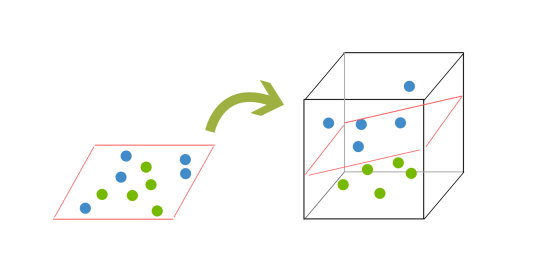

# AI_classifier
an AI that classifies lines of text by romanian / moldovan dialect
I created 2 versions with different classifiers, in 2 different files "proiect" and "proiect_2". I chose the method "Bag of Words" as a way of processing my data (the text). 
I split the lines into words, gt rid of some punctuation, and created a dictionary in which the words are the keys and the id of the line is the value.
Using the said dictionary, a list of sentences and a list of words and I created my features matrix, the features matrix is of shape 
((len(self.list_sentences), len(self.list_words))), where for each sentence we count how many times said word is contained in the sentence. After normalizing the data, 
I trained my classifiers and chose the right parameters that would minimize my loss. The accuracy is around 67-70%.

Most classifiers I tried(like sklearn.svm.SVC) are using support vectors in order to solve this classifying problem, and an AI with a neural network was not needed.
A support vector machine tries to find a straight line that would best separate the feature-label data of the classes. 

If the data is not separable, the data is transfered into a space of one dimension higher (for example 2d -> 3d), and the SVM tries to separate the data by finding a hyperplane 
(for a 3d space, it would use a 2d space for separation).

